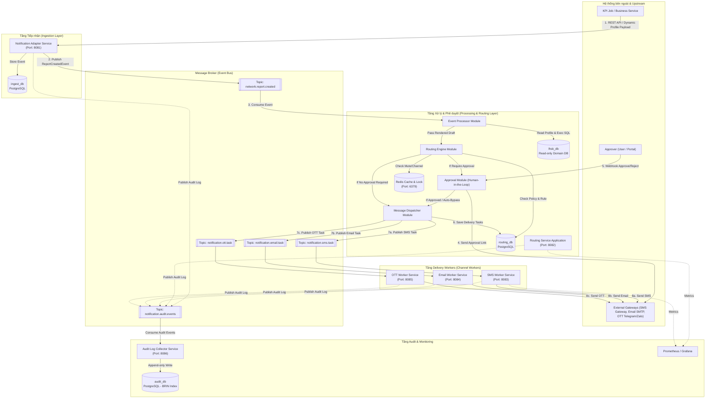
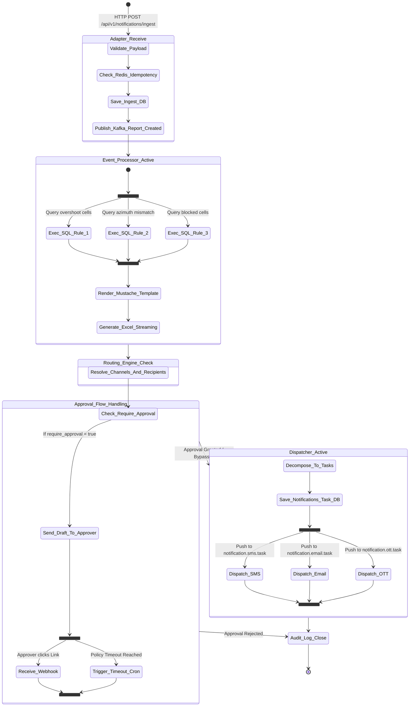
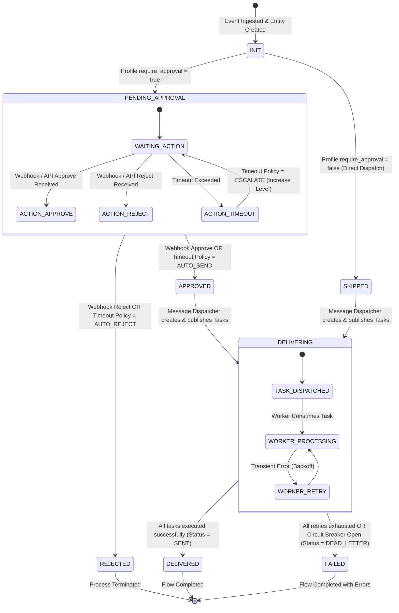
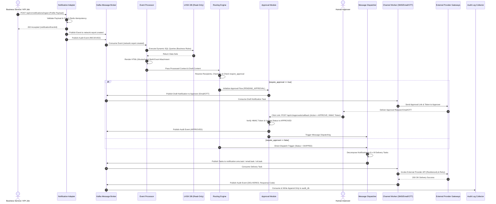

# BÁO CÁO THIẾT KẾ CHI TIẾT HỆ THỐNG (LOW-LEVEL DESIGN - LLD)
## HỆ THỐNG PHÁT TÁN THÔNG BÁO VÀ PHÊ DUYỆT ĐA KÊNH NETEVENT

---

# PHẦN B: LOW-LEVEL DESIGN (LLD)

## 1. Sơ đồ khối (Block Diagram)

Sơ đồ khối thể hiện mối liên kết kiến trúc giữa các microservice, Kafka Bus, Redis Cache và cơ sở dữ liệu lưu trữ rời rạc (`lhsk_db`, `ingest_db`, `routing_db`, `audit_db`).



---

## 2. Sơ đồ luồng (Flowchart)

Sơ đồ luồng tiến trình vận hành nghiệp vụ từ lúc Job KPI hoàn thành, xử lý dữ liệu động, kiểm tra cờ phê duyệt, cho tới khi phát tán tin nhắn hoặc kết thúc chu kỳ khi bị từ chối/timeout.

```mermaid
flowchart TD
    Start([Job KPI Hoàn Thành]) --> Ingest_Step[Notification Adapter Tiếp Nhận Profile & Payload]
    Ingest_Step --> Check_Idempotency{Kiểm tra Idempotency<br/>Redis SETNX?}
    
    Check_Idempotency -- Đã tồn tại --> Duplicate_End([Bỏ qua Event Trùng Lặp])
    Check_Idempotency -- Hợp lệ mới --> Save_Ingest[Lưu notification_event vào ingest_db với status RECEIVED]
    
    Save_Ingest --> Pub_Kafka[Kafka Producer phát tín hiệu network.report.created]
    Pub_Kafka --> Consume_Event[Event Processor nhận Event từ Kafka]
    
    Consume_Event --> Fetch_Rules[Tra cứu profile_business_rule_mapping từ DB]
    Fetch_Rules --> Exec_SQL[Thực thi các câu truy vấn SQL động song song với safe parameter]
    Exec_SQL --> Check_SQL_Success{Thực thi SQL thành công?}
    
    Check_SQL_Success -- Thất bại một phần --> Log_Partial[Ghi log lỗi partial failure, giữ lại dữ liệu thành công]
    Check_SQL_Success -- Thành công --> Render_Draft[Render HTML Content & Dựng file đính kèm Excel]
    Log_Partial --> Render_Draft

    Render_Draft --> Resolve_Recipients[Routing Engine: Tra cứu Người nhận, Kênh & Tần suất]
    Resolve_Recipients --> Check_Approval_Flag{Profile yêu cầu Phê duyệt?<br/>require_approval == true?}
    
    Check_Approval_Flag -- Không (False) --> Direct_Dispatch[Trạng thái: APPROVED / SKIPPED<br/>Chuyển Message Dispatcher]
    
    Check_Approval_Flag -- Có (True) --> Create_Approval[Trạng thái: PENDING_APPROVAL<br/>Tạo bản ghi approval_flow & Gửi Notification Draft tới Approver]
    
    Create_Approval --> Wait_Response{Chờ phản hồi từ Approver}
    
    Wait_Response -- Webhook Callback: Approve --> Approved_State[Cập nhật status = APPROVED]
    Approved_State --> Direct_Dispatch
    
    Wait_Response -- Webhook Callback: Reject --> Rejected_State[Cập nhật status = REJECTED]
    Rejected_State --> Audit_Reject[Ghi Audit Log: Bị Từ Chối] --> End_Process([Kết Thúc Tiến Trình])
    
    Wait_Response -- Quá thời hạn (Timeout) --> Check_Timeout_Policy{Xử lý Timeout Policy}
    Check_Timeout_Policy -- AUTO_SEND --> Auto_Send_State[Cập nhật status = APPROVED - Auto Send] --> Direct_Dispatch
    Check_Timeout_Policy -- AUTO_REJECT --> Rejected_State
    Check_Timeout_Policy -- ESCALATE --> Escalate_Next[Tăng cấp Approve Level] --> Wait_Response

    Direct_Dispatch --> Decompose_Tasks[Message Dispatcher: Phân rã thành Delivery Tasks<br/>Notification x Channel x Recipient]
    Decompose_Tasks --> Save_Task_DB[Lưu notifications_task với unique key constraint]
    Save_Task_DB --> Pub_Channel_Kafka[Push Task vào Kafka Topics theo Kênh<br/>SMS / Email / OTT]
    
    Pub_Channel_Kafka --> Channel_Worker[Channel Workers Consume Task]
    Channel_Worker --> Exec_Send{Gửi tin qua Gateway<br/>Circuit Breaker & Retry}
    
    Exec_Send -- Thành công --> Success_Audit[Cập nhật Task status = SENT<br/>Bắn Audit Log Event]
    Exec_Send -- Thất bại (Exceed Max Retries) --> DLQ_Audit[Cập nhật Task status = DEAD_LETTER<br/>Bắn DLQ & Audit Log Event]
    
    Success_Audit --> End_Process
    DLQ_Audit --> End_Process
```



---

## 3. Sơ đồ Activity (Activity Diagram)

Sơ đồ Activity mô tả chi tiết sự kết hợp giữa các hoạt động xử lý song song (chạy SQL các nghiệp vụ con, phát tán đa kênh) và luồng phê duyệt bất đồng bộ Human-in-the-loop.



---

## 4. Sơ đồ máy trạng thái (State Machine)

Sơ đồ máy trạng thái thể hiện toàn bộ vòng đời (Lifecycle) của một yêu cầu thông báo/phê duyệt trong hệ thống qua các trạng thái `INIT`, `PENDING_APPROVAL`, `APPROVED`, `REJECTED`, `SKIPPED`, `DELIVERING`, `DELIVERED`, và `FAILED`.



---

## 5. Sơ đồ tuần tự (Sequence Diagram)

Sơ đồ tuần tự thể hiện tương tác thời gian giữa các thành phần hệ thống trong trường hợp luồng có phê duyệt (Human-in-the-loop).



---

## 2. Danh sách module & trách nhiệm

| Module | Trách nhiệm chính | Công nghệ & Subservice |
| :--- | :--- | :--- |
| **Notification Adapter** | Nhận Profile từ Business Service, validate payload, kiểm tra trùng lặp (Idempotency), lưu `ingest_db`, publish event lên Kafka topic `network.report.created`. | Spring Boot, Jakarta Validation, Redis (`SETNX`), Kafka Template (`ingest_db`). |
| **Event Processor** | Tra cứu cờ nghiệp vụ con (`profile_business_rule_mapping`), thực thi các câu SQL động an toàn trên database đọc `lhsk_db`, render template Mustache & dựng đính kèm Excel. | Spring Kafka Consumer, NamedParameterJdbcTemplate, Mustache Engine, Apache POI Streaming (`SXSSF`). |
| **Routing Engine** | Xác định kênh gửi (SMS/Email/OTT), tra cứu danh sách người nhận & nhóm người nhận, xử lý tần suất (Real-time/Scheduled/Batch), kiểm tra cờ phê duyệt `require_approval`. | Spring Data JPA (`routing_db`), Cache Caffeine/Redis, Cron Scheduler. |
| **Approval Module** | Quản lý vòng đời phê duyệt bất đồng bộ (State Machine), phát tán draft tới Approver, tiếp nhận Webhook callback có chữ ký HMAC, xử lý timeout tự động qua Scheduled Jobs. | Spring StateMachine, JWT HMAC-SHA256, Scheduled Task Executor. |
| **Message Dispatcher** | Phân rã `Notification` đã được duyệt thành $N \times M$ `notifications_task` theo Kênh $\times$ Người nhận, đảm bảo Idempotency key, push vào các topic Kafka theo từng kênh. | Transactional Outbox pattern, Spring Data JPA, Kafka Template. |
| **Channel Worker (SMS/Email/OTT)** | Consume Task từ Kafka topic chuyên biệt của từng kênh, gửi tin qua Provider Gateways, tích hợp Circuit Breaker, Retry & Backoff với Jitter, tôn trọng trạng thái MUTE. | Resilience4j, Spring Kafka Listener, WebClient / RestTemplate, Provider Adapters. |
| **Audit Log Collector** | Ghi nhận sự kiện bất đồng bộ từ tất cả các module theo cơ chế append-only, lưu trữ tối ưu dữ liệu lớn với BRIN index. | Spring Kafka Consumer, Spring Data JPA (`audit_db`), PostgreSQL BRIN Indexing. |

---

## 3. Notification Adapter

### 3.1 Interface tiếp nhận Profile
System hỗ trợ tiếp nhận qua REST API Endpoint:
- **Endpoint**: `POST /api/v1/notifications/ingest`
- **Headers**: `Content-Type: application/json`, `X-Idempotency-Key: <UUID>`

**Request DTO (`KpiReportRequest.java`)**:
```java
public class KpiReportRequest {
    @NotBlank(message = "eventCode is mandatory")
    private String eventCode;
    
    @NotBlank(message = "eventName is mandatory")
    private String eventName;
    
    @NotBlank(message = "profileName is mandatory")
    private String profileName;
    
    private String type;
    private String severity;
    
    @NotNull(message = "payload is mandatory")
    private Map<String, Object> payload;
}
```

### 3.2 Luồng xử lý (pseudocode)
```java
@PostMapping("/ingest")
public ResponseEntity<IngestResponse> ingestNotification(
        @RequestHeader("X-Idempotency-Key") String idempotencyKey,
        @Valid @RequestBody KpiReportRequest request) {

    // 1. Check Redis Idempotency Lock
    boolean acquired = redisTemplate.opsForValue()
        .setIfAbsent("idempotency:event:" + request.getEventCode(), "LOCKED", Duration.ofMinutes(30));
    if (!acquired) {
        throw new DuplicateEventException("Event code already processed: " + request.getEventCode());
    }

    // 2. Validate Profile Existence in DB
    ProfileEntity profile = profileRepository.findByProfileName(request.getProfileName())
        .orElseThrow(() -> new InvalidProfileException("Profile not found: " + request.getProfileName()));

    // 3. Save NotificationEvent to ingest_db
    NotificationEventEntity eventEntity = NotificationEventEntity.builder()
        .eventCode(request.getEventCode())
        .profileName(request.getProfileName())
        .eventName(request.getEventName())
        .rawEventPayload(objectMapper.writeValueAsString(request.getPayload()))
        .status("RECEIVED")
        .receivedAt(Instant.now())
        .build();
    eventRepository.save(eventEntity);

    // 4. Publish Event to Kafka
    ReportCreatedEvent kafkaEvent = ReportCreatedEvent.builder()
        .eventId(eventEntity.getNotificationEventId())
        .eventCode(request.getEventCode())
        .profileName(request.getProfileName())
        .payload(request.getPayload())
        .build();
    kafkaPublisher.publishReportCreatedEvent(kafkaEvent);

    return ResponseEntity.accepted().body(new IngestResponse(eventEntity.getNotificationEventId(), "RECEIVED"));
}
```

### 3.3 Validate logic
- **Format Validation**: Đảm bảo các trường bắt buộc không `null` hoặc rỗng (`@NotBlank`, `@NotNull`).
- **Profile Integrity**: Tra cứu `profile_name` trong bảng `profile` (database `lhsk_db`/`routing_db`). Nếu `status != 'ACTIVE'`, từ chối tiếp nhận với HTTP status 422 Unprocessable Entity.
- **Payload Schema Check**: Kiểm tra các tham số truyền vào phù hợp với định dạng JSON schema đã đăng ký cho từng Profile.

### 3.4 Idempotency
- **Cơ chế**: Kết hợp giữa **Redis Distributed Lock** và **Database Unique Constraint**.
- **Redis Key**: `idempotency:event:{eventCode}` với TTL = 30 phút.
- **Database Constraint**: Constraint `UNIQUE(event_code)` trong bảng `notification_event` thuộc `ingest_db` ngăn chặn trùng lặp tuyệt đối ở tầng đĩa.

### 3.5 Kafka Producer Cấu hình
| Cấu hình | Giá trị |
| :--- | :--- |
| **Topic** | `network.report.created` |
| **Key** | `eventCode` (đảm bảo ordering theo từng sự kiện) |
| **Partitions** | 10 Partitions |
| **acks** | `all` (-1) - Đảm bảo tất cả In-Sync Replicas xác nhận |
| **retries** | 10 lần |
| **enable.idempotence** | `true` |
| **max.in.flight.requests.per.connection** | 5 |
| **Serialization** | `StringSerializer` (Key), `JsonSerializer` (Value) |
| **Compression Type** | `snappy` |

### 3.6 Xử lý lỗi
| Tình huống | Phương án Xử lý |
| :--- | :--- |
| **Kafka broker không phản hồi** | Retries tự động 10 lần với exponential backoff. Nếu hết retry, rollback transaction ghi DB, xả lock Redis, trả về HTTP status 503 Service Unavailable để Upstream retry. |
| **Profile validate lỗi** | Ghi log `WARN`, lưu trạng thái event trong `ingest_db` thành `INVALID`, trả về HTTP status 400 Bad Request kèm chi tiết lỗi validation. |
| **Dữ liệu payload bị hỏng (Malformed JSON)** | Đánh dấu event status là `INCOMPLETE`, đẩy vào Dead Letter Topic (`network.report.created.DLT`) để tra soát thủ công. |

---

## 4. Event Processor

### 4.1 Kafka Consumer Cấu hình
| Cấu hình | Giá trị |
| :--- | :--- |
| **Topic** | `network.report.created` |
| **Consumer group** | `event-processor-group` |
| **enable.auto.commit** | `false` (Manual Immediate Ack sau khi hoàn tất xử lý DB) |
| **Concurrency** | 5 Thread Consumers |
| **max.poll.records** | 500 records |
| **session.timeout.ms** | 45000 ms |

### 4.2 Business Rule Resolver
- Tra cứu danh sách các Business Rules thuộc về `profile_name` trong sự kiện qua bảng `profile_business_rule_mapping`.
- Lấy danh sách câu lệnh SQL động (`sql_query`) và thứ tự thực thi (`execution_order`) tương ứng từ bảng `business_rule`.

### 4.3 Query Executor (thực thi SQL động an toàn)
- **Safe SQL Execution**: Sử dụng `NamedParameterJdbcTemplate` để bind tham số an toàn, ngăn ngừa hoàn toàn SQL Injection.
- **Whitelist Regex**: Kiểm tra câu SQL trong bảng `business_rule` chỉ chứa câu lệnh `SELECT`, không được chứa `DROP`, `DELETE`, `UPDATE`, `INSERT`, `EXEC`.
- **Read-only Connection Pool**: Đấu nối tới database `lhsk_db` qua User PostgreSQL chỉ có quyền `SELECT` với `transaction_read_only = true`.
- **Query Timeout**: Đặt timeout cứng 5 giây cho mỗi câu lệnh SQL (`jdbcTemplate.setQueryTimeout(5)`).

### 4.4 Template Rendering & Excel Generator
- **Template Engine**: Sử dụng **Mustache Engine** nạp template từ `routing_template.content`. Gắn dữ liệu kết quả từ các câu lệnh SQL vào context object để sinh ra nội dung HTML/Text hoàn chỉnh.
- **Excel Generator**: Nếu kết quả SQL vượt quá 50 dòng, module khởi chạy **Apache POI Streaming (`SXSSFWorkbook`)** để xuất báo cáo đính kèm `.xlsx` với bộ nhớ đệm thấp (row window size = 100), ghi file tạm vào thư mục scratch hoặc MinIO/S3.

### 4.5 Xử lý lỗi từng nghiệp vụ con (partial failure)
- Khi thực thi tập hợp $N$ business rules cho một Profile: Mỗi câu SQL được bọc trong block `try-catch` hoặc `CompletableFuture.handle()`.
- Nếu một sub-rule bị lỗi (ví dụ: Timeout hoặc sai tham số), log lỗi `ERROR`, đánh dấu kết quả rule đó là `FAILED_TO_EXECUTE`, đồng thời **vẫn tiếp tục xử lý các sub-rules còn lại** để tạo partial notification context thay vì hủy bỏ toàn bộ sự kiện.

### 4.6 Offset commit
- Offset chỉ được commit (`acknowledgment.acknowledge()`) **SAU KHI** toàn bộ nội dung rendered draft và context đã được chuyển giao và lưu trữ thành công vào database `routing_db`.

---

## 5. Routing Engine

### 5.1 Channel Resolver
Dựa trên cấu hình trong `profile_channel` và `profile_account`:
- Lọc danh sách các kênh truyền thông hợp lệ cho Profile (`SMS`, `EMAIL`, `OTT`).

### 5.2 Recipient Resolver
- Resolving người nhận từ cấu hình `recipient`, `recipient_group`, và `recipient_group_member`.
- Trích xuất thông tin liên lạc đa kênh từ trường JSONB `channel_contacts`:
  ```json
  {
    "email": "user@example.com",
    "sms": "84988888888",
    "ott_chat_id": "telegram_12345678"
  }
  ```
- **Filter Mute**: Loại bỏ các người nhận có trạng thái `status = 'MUTED'` hoặc nằm trong khung giờ yên lặng (Quiet Hours).

### 5.3 Frequency Handler
| Chế độ | Xử lý |
| :--- | :--- |
| **REALTIME** | Đẩy trực tiếp sang Approval Module hoặc Message Dispatcher ngay sau khi tạo Notification. |
| **SCHEDULED** | Lưu bản ghi ở trạng thái `SCHEDULED`, tính toán `scheduled_at` và kích hoạt Quartz Job / Spring `@Scheduled` để đẩy tin đúng giờ chỉ định. |
| **BATCH_WINDOW** | Gom các Notification cùng Profile vào Redis List buffer theo khung giờ (ví dụ: 15 phút/lần). Khi cửa sổ batch đóng, tổng hợp dữ liệu thành 1 thông báo duy nhất. |

### 5.4 Approval Requirement Checker
- Tra cứu cờ `require_approval` trong bảng `profile` và kiểm tra cấu hình trong `approval_policy`.
- Nếu `require_approval == true`, khởi tạo bản ghi `notifications` với trạng thái `PENDING_APPROVAL` và tạo các bản ghi `approval_flow`.
- Nếu `require_approval == false`, chuyển thẳng trạng thái thành `SKIPPED` và gửi sang Message Dispatcher.

---

## 6. Approval Module (Human-in-the-loop)

### 6.1 State machine
Máy trạng thái quản lý các chuyển dịch của bản ghi `notifications` và `approval_flow`:
- `PENDING` $\xrightarrow{\text{Approve Callback}}$ `APPROVED`
- `PENDING` $\xrightarrow{\text{Reject Callback}}$ `REJECTED`
- `PENDING` $\xrightarrow{\text{Timeout Exceeded}}$ `TIMEOUT` $\rightarrow$ (`AUTO_SEND` / `AUTO_REJECT` / `ESCALATED`)

### 6.2 Gửi draft tới Approver
Nội dung Draft gửi tới người phê duyệt qua Email/OTT bao gồm:
- Tóm tắt báo cáo KPI và file đính kèm Excel (nếu có).
- Link thao tác nhanh chứa Signed Token (JWT HMAC-SHA256):
  - Link Approve: `https://netevent.example.com/api/v1/approvals/action?token=<JWT>&decision=APPROVE`
  - Link Reject: `https://netevent.example.com/api/v1/approvals/action?token=<JWT>&decision=REJECT`

### 6.3 Webhook callback nhận Approve/Reject
- **Endpoint**: `POST /api/v1/approvals/callback`
- **Request Payload (`ApprovalDecisionRequest.java`)**:
  ```java
  public class ApprovalDecisionRequest {
      private UUID approvalId;
      private String approverId;
      private String action; // APPROVE or REJECT
      private String comment;
      private String signature; // HMAC-SHA256
  }
  ```
- **Xử lý**: Xác minh chữ ký `signature`, kiểm tra Token còn trong thời hạn hay không. Cập nhật `responded_at`, đổi `status` trong `approval_flow` và `notifications`.

### 6.4 Xử lý timeout
Sử dụng Cron Job quét định kỳ các bản ghi `approval_flow` có `status = 'PENDING'` và `sent_at + timeout_minutes < NOW()`:
- **Cấu hình `timeout_action`**:
  - `AUTO_SEND`: Cập nhật status `notifications` thành `APPROVED`, kích hoạt phát tán tin nhắn.
  - `AUTO_REJECT`: Cập nhật status `notifications` thành `REJECTED`, hủy bỏ chu kỳ.
  - `ESCALATE`: Tăng cấp phê duyệt `level_order = level_order + 1`, gửi draft tới Approver cấp cao hơn.

### 6.5 Nhiều cấp phê duyệt (nếu cấu hình)
Hệ thống hỗ trợ nhiều cấp phê duyệt theo thứ tự `level_order`:
- Khi Cấp 1 phê duyệt (`APPROVED`), kiểm tra xem có `level_order` tiếp theo trong `approval_policy` hay không.
- Nếu còn cấp tiếp theo: Giữ trạng thái `notifications` ở `PENDING_APPROVAL`, khởi tạo `approval_flow` cho Cấp 2.
- Khi Cấp cuối cùng phê duyệt thành công: Chuyển trạng thái `notifications` sang `APPROVED` để phát tán.

---

## 7. Message Dispatcher

### 7.1 Phân rã task
Từ 1 bản ghi `notifications` đã được duyệt, Dispatcher truy vấn danh sách kênh và người nhận hợp lệ, thực hiện phân rã thành $N \times M$ bản ghi `notifications_task` ($N$ người nhận $\times$ $M$ kênh gửi tin).

### 7.2 Kafka topic theo kênh
| Kênh | Topic | Partitions | Keying Strategy |
| :--- | :--- | :--- | :--- |
| **SMS** | `notification.sms.task` | 10 | `recipient_id` |
| **Email** | `notification.email.task` | 10 | `recipient_id` |
| **OTT** | `notification.ott.task` | 10 | `recipient_id` |

### 7.3 Idempotency key
Để tránh gửi trùng lặp tin nhắn cho người nhận, mỗi `notifications_task` sở hữu Constraint duy nhất tại Database:
```sql
CONSTRAINT uq_task_dedup UNIQUE (notification_id, channel_id, recipient_id)
```
Chuỗi Idempotency Key gửi kèm trong Kafka Header: `{notificationId}_{channelId}_{recipientId}`.

---

## 8. Channel Worker (SMS / Email / OTT)

### 8.1 Thiết kế chung
Mỗi Channel Worker là một microservice độc lập lắng nghe Task từ Kafka topic tương ứng:
1. Consumer nhận Task message.
2. Kiểm tra cờ Circuit Breaker với Provider.
3. Thực thi gửi tin thông qua Provider Adapter qua API HTTP/REST hoặc SMPP.
4. Bắn sự kiện Audit Log về kết quả gửi tin (`SENT` hoặc `FAILED`).

### 8.2 Retry & backoff
| Tham số | Giá trị mặc định |
| :--- | :--- |
| **Số lần retry tối đa** | 3 lần |
| **Chiến lược** | Exponential Backoff with Jitter (Khoảng chờ: 2s, 4s, 8s) |
| **Sau khi vượt giới hạn** | Đánh dấu Task status = `DEAD_LETTER`, đẩy payload vào topic Dead Letter Queue `notification.<channel>.DLQ` và bắn cảnh báo về hệ thống giám sát. |

### 8.3 Circuit breaker
Sử dụng **Resilience4j CircuitBreaker**:
| Tham số | Giá trị mặc định |
| :--- | :--- |
| **Ngưỡng mở (Failure Rate Threshold)** | 50% lỗi trong cửa sổ 100 requests gần nhất |
| **Thời gian mở (Wait Duration in Open State)** | 30 giây (Chuyển trạng thái sang OPEN, không gọi Provider Gateway) |
| **Trạng thái half-open (Permitted Calls)** | 10 calls thử nghiệm để đánh giá khôi phục |

### 8.4 Provider Adapter Interface (mở rộng kênh mới)
Interface chuẩn định nghĩa cho mọi Provider Adapter:
```java
public interface ChannelProviderAdapter {
    String getChannelCode(); // e.g. "SMS", "EMAIL", "OTT"
    DeliveryResponse send(NotificationTaskEntity task, String contactTarget, String content);
}
```

---

## 9. Bảo mật triển khai chi tiết

### 9.1 HMAC signature cho webhook
- Mọi Webhook callback từ phía Approver hoặc Provider đều phải có Header `X-Signature`.
- **Cách tính**: `HMAC-SHA256(payload + timestamp, secret_key)`.
- Server tính toán lại chữ ký và so sánh khớp tuyệt đối (`MessageDigest.isEqual`). Loại bỏ request nếu timestamp lệch quá 300 giây để phòng chống Replay Attack.

### 9.2 IP whitelist
- **API Gateway / NGINX**: Đã cấu hình Whitelist dải IP nội bộ CIDR (ví dụ: `10.0.0.0/8`, `192.168.1.0/24`) cho các API tiếp nhận Profile và Callback.
- **Spring Security**: Enforce IP check trên Filter chain: `hasIpAddress('10.0.0.0/8')`.

### 9.3 AuthN/AuthZ cho API quản trị
- **Authentication**: JWT Access Token được cấp bởi Keycloak / Identity Server.
- **Authorization (RBAC)**: Phân quyền theo Role quy định trong bảng `role`:
  - `ADMIN`: Full quyền cấu hình hệ thống, Profile, Channel.
  - `BUSINESS_OWNER`: Quản lý Business Rules, Routing Template.
  - `NOC_STAFF`: Xem log, tra soát tiến trình gửi tin, trigger gửi lại (Retry).
  - `APPROVER`: Phê duyệt hoặc từ chối các yêu cầu thông báo.
  - `VIEWER`: Chỉ xem báo cáo dashboard.

---

## 10. API quản trị & tra soát (tổng hợp)

| Endpoint | Method | Role tối thiểu | Mô tả |
| :--- | :--- | :--- | :--- |
| `/api/v1/notifications/ingest` | `POST` | `SYSTEM` / `ADMIN` | Tiếp nhận yêu cầu phát tán thông báo từ KPI Job |
| `/api/v1/approvals/callback` | `POST` | `APPROVER` | Webhook tiếp nhận quyết định Approve/Reject từ người duyệt |
| `/api/v1/notifications/search` | `GET` | `NOC_STAFF` | Tra cứu trạng thái các yêu cầu thông báo theo trang, thời gian, profile |
| `/api/v1/notifications/{id}/tasks` | `GET` | `NOC_STAFF` | Xem danh sách delivery tasks chi tiết theo từng kênh của 1 notification |
| `/api/v1/tasks/{taskId}/retry` | `POST` | `NOC_STAFF` | Re-trigger gửi lại thủ công một Task bị FAILED |
| `/api/v1/profiles` | `GET` / `POST` | `BUSINESS_OWNER` | Quản lý danh mục Profile thông báo |
| `/api/v1/rules` | `GET` / `POST` | `BUSINESS_OWNER` | Quản lý câu lệnh SQL Business Rules |
| `/api/v1/audit/logs` | `GET` | `ADMIN` / `NOC_STAFF` | Tra soát Audit History sự kiện hệ thống |

---

## 11. Audit Log Collector

### 11.1 Cơ chế ghi nhận
- Tất cả các Microservice phát ra sự kiện Audit dạng JSON tới Kafka topic `notification.audit.events`.
- Service `Audit Log Collector` consume bất đồng bộ từ Kafka và thực hiện ghi **Append-only** vào cơ sở dữ liệu `audit_db` (bảng `audit_history`).
- Để tối ưu truy vấn dữ liệu theo thời gian thực khổng lồ, bảng `audit_history` sử dụng **BRIN Index (Block Range Index)** trên cột `created_at`:
  ```sql
  CREATE INDEX brin_audit_created_at ON audit_history USING BRIN(created_at);
  ```

### 11.2 Cấu trúc sự kiện chuẩn
```json
{
  "eventId": "e9b1a2c3-4d5e-6f7a-8b9c-0d1e2f3a4b5c",
  "taskId": "a1b2c3d4-e5f6-7a8b-9c0d-1e2f3a4b5c6d",
  "notificationId": "b2c3d4e5-f6a7-8b9c-0d1e-2f3a4b5c6d7e",
  "module": "SMS_WORKER",
  "action": "SEND_MESSAGE",
  "actor": "SMS_WORKER_SERVICE",
  "recipientContact": "84988888888",
  "channelCode": "SMS",
  "status": "DELIVERED",
  "responseCode": "200_OK",
  "responseBody": "{\"messageId\":\"PROVIDER_MSG_998811\"}",
  "timestamp": "2026-09-11T09:45:00.123Z"
}
```

---

## 12. Cấu hình hệ thống (mẫu application.yml)

Mẫu cấu hình chuẩn production áp dụng cho `routing-service`:

```yaml
server:
  port: 8082
  servlet:
    context-path: /

spring:
  application:
    name: routing-service

  datasource:
    url: ${SPRING_DATASOURCE_URL:jdbc:postgresql://localhost:5432/routing_db}
    username: ${SPRING_DATASOURCE_USERNAME:postgres}
    password: ${SPRING_DATASOURCE_PASSWORD:postgres}
    driver-class-name: org.postgresql.Driver
    hikari:
      maximum-pool-size: 20
      minimum-idle: 5
      idle-timeout: 300000
      connection-timeout: 20000

  jpa:
    hibernate:
      ddl-auto: validate
    show-sql: false
    properties:
      hibernate:
        dialect: org.hibernate.dialect.PostgreSQLDialect
        format_sql: false

  data:
    redis:
      host: ${SPRING_REDIS_HOST:localhost}
      port: ${SPRING_REDIS_PORT:6379}
      timeout: 2000ms

  kafka:
    bootstrap-servers: ${SPRING_KAFKA_BOOTSTRAP_SERVERS:localhost:9092}
    consumer:
      group-id: routing-service-group
      auto-offset-reset: earliest
      enable-auto-commit: false
      key-deserializer: org.apache.kafka.common.serialization.StringDeserializer
      value-deserializer: org.springframework.kafka.support.serializer.JsonDeserializer
      properties:
        spring.json.trusted.packages: "*"
    producer:
      key-serializer: org.apache.kafka.common.serialization.StringSerializer
      value-serializer: org.springframework.kafka.support.serializer.JsonSerializer
      acks: all
      retries: 10
      properties:
        enable.idempotence: true

app:
  kafka:
    topics:
      report-created: network.report.created
      sms-task: notification.sms.task
      email-task: notification.email.task
      ott-task: notification.ott.task
      audit-events: notification.audit.events

resilience4j:
  circuitbreaker:
    instances:
      providerService:
        slidingWindowSize: 100
        failureRateThreshold: 50
        waitDurationInOpenState: 30000ms
        permittedNumberOfCallsInHalfOpenState: 10

management:
  endpoints:
    web:
      exposure:
        include: health,metrics,prometheus,info
  metrics:
    export:
      prometheus:
        enabled: true
```

---

## 14. Logging & Monitoring chi tiết

### 14.1 Metrics thu thập qua Prometheus
- `notification_events_total{status="RECEIVED|INVALID|PROCESSED"}`: Tổng số sự kiện tiếp nhận.
- `delivery_task_latency_seconds`: Latency thời gian xử lý phát tán tin nhắn qua từng kênh.
- `approval_timeout_total{profile="..."}`: Số lượng phê duyệt bị timeout.
- `resilience4j_circuitbreaker_state{name="..."}`: Trạng thái Circuit Breaker (`CLOSED`, `OPEN`, `HALF_OPEN`).
- `kafka_consumer_lag{topic="...",group="..."}`: Độ trễ tiêu thụ message trên Kafka.

### 14.2 Grafana Dashboards & Alert Rules
- **Alert Rule 1 (High Delivery Failure Rate)**: Nếu tỉ lệ Task bị `DEAD_LETTER` > 5% trong 5 phút $\rightarrow$ Bắn cảnh báo PagerDuty/Telegram tới NOC.
- **Alert Rule 2 (High Consumer Lag)**: Nếu Consumer Lag trên topic `network.report.created` > 1000 records trong 3 phút $\rightarrow$ Bắn cảnh báo Auto-scaling Worker.
- **Alert Rule 3 (Circuit Breaker Open)**: Khi Circuit Breaker chuyển trạng thái `OPEN` $\rightarrow$ Bắn cảnh báo Gateway Provider xuống cấp.

### 14.3 Distributed Tracing (OpenTelemetry / Zipkin)
- Mọi HTTP Request và Kafka Event đều truyền theo Header `traceparent` (W3C Trace Context Standard).
- **Trace Format**: `00-{traceId}-{spanId}-{traceFlags}`.
- Giúp tra soát toàn bộ vòng đời của một Notification qua các microservices trên giao diện Jaeger/Zipkin.

---
*Báo cáo Thiết kế Chi tiết (LLD) hoàn thiện cho Hệ thống NetEvent Notification & Approval.*
